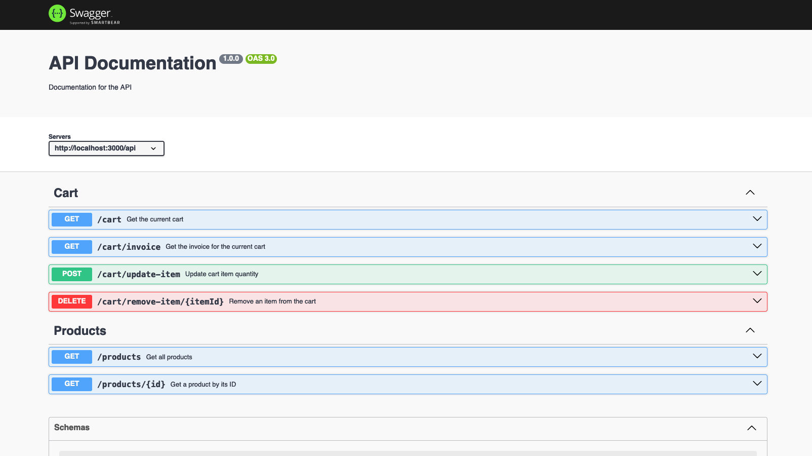
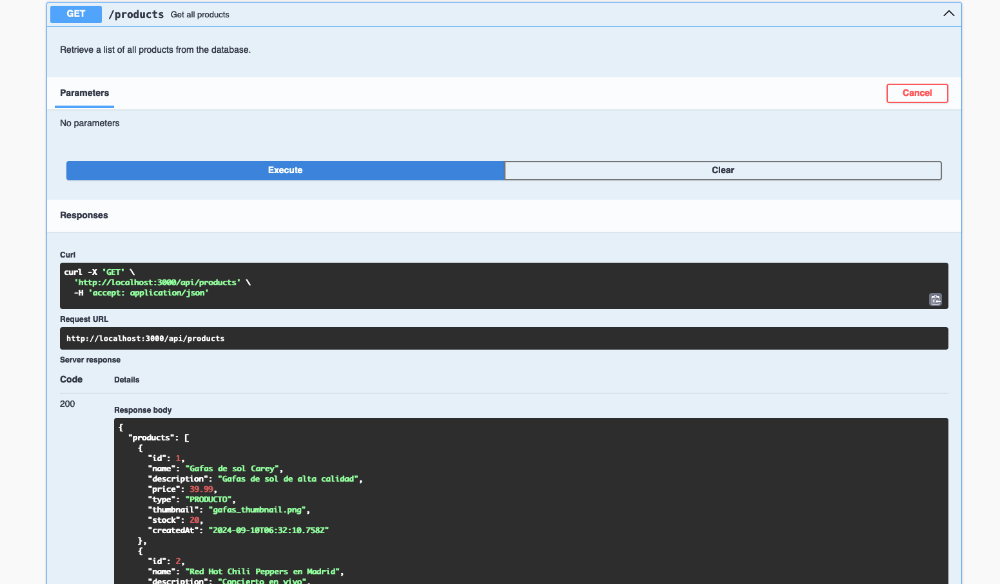

# Table of Contents
- [Table of Contents](#table-of-contents)
- [Shopping Cart API](#shopping-cart-api)
  - [Prerequisites](#prerequisites)
  - [Steps and scripts to run the Project](#steps-and-scripts-to-run-the-project)
    - [1. Clone the repository](#1-clone-the-repository)
    - [2. Enter the project](#2-enter-the-project)
    - [3. Run containers](#3-run-containers)
    - [Run migrations](#run-migrations)
    - [5. Run seeds](#5-run-seeds)
    - [6. Use API](#6-use-api)
  - [Extra scripts to manage the container](#extra-scripts-to-manage-the-container)
    - [1. To run the container without build the container again](#1-to-run-the-container-without-build-the-container-again)
    - [2. To stop the container](#2-to-stop-the-container)
    - [3. To delete the container](#3-to-delete-the-container)

# Shopping Cart API
This project implements a shopping cart system using Node.js, Express, Prisma, MySQL, and Swagger for API documentation. The application is containerized using Docker to facilitate development and deployment. This image is going to build two container:
1. **NodeJS container:** To run the API.
2. **MySQL engine container:**: To persist the information, also is possible to see the DB using a client like MySQL Workbench. 


## Prerequisites
**You moust to have installed Docker and Docker Compose**

## Steps and scripts to run the Project

### 1. Clone the repository 
```bash
git clone https://github.com/felipegarcial/shopping_cart_backend.git
```
### 2. Enter the project
```bash
cd shopping_cart_backend
```
### 3. Run containers
```bash
npm run docker:dev-build
```
### Run migrations
```bash
npm run docker:dev-migration
```
### 5. Run seeds
```bash
npm run docker:dev-seed
```

### 6. Use API
Once the project is running you can check the API documentation at[text](http://localhost:3000/api-docs/), you can use swagger aplication or any cliente like postman.





## Extra scripts to manage the container

### 1. To run the container without build the container again
```bash
npm run docker:dev-up
```

### 2. To stop the container
```bash
npm run docker:dev-down
```


### 3. To delete the container
```bash
npm run docker:dev-down
```
